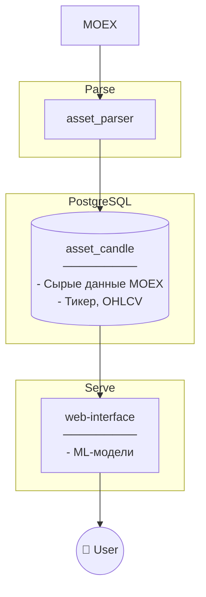

# Инвестиционный Советник

## О приложении

`Инвестиционный советник` - приложение, занимающееся прогнозированием цен на акции, основываясь на исторических данных и новостях.

### Архитектура



### Пайплайн работы приложения

#### 1. Парсинг и обработка данных

- Парсит "Японские свечи" с MOEX

#### 2. Прогнозирование

По запросу пользователя выдает прогнозируемую стоимость акций.

## Структура приложения

- **`alembic/`** - миграции в БД

- **`api/`** - API-ручки

- **`certs/`** - сертификаты

- **`config/`** — настройки приложения

- **`core/`** — основная бизнес-логика приложения:
  - `auth/` - аутентификация
  - `clients/` — клиенты для внешних API
  - `database/` — работа с базой данных (БД)
    - `db_models/` - SQLAlchemy модели таблиц БД. Из них alembic генерирует миграции в БД
    - `repository/` - CRUD операции с таблицами БД
  - `processors/` - обработчики данных
  - `schemas/` - Pydantic схемы данных

- **`daemons/`** — демоны (фоновые процессы)

- **`docs/`** — документация проекта

- **`scripts/`** — документация проекта

## Разработка

### Начало работы

1. Установить `uv`
2. Создать в корне репозитория файл `.env` с содержимым из [.env.example](../.env.example).

По умолчанию, у админского аккаунта login=admin, password=admin. Можно поменять на другой.

Чтобы получить хэш пароля, запустите: `make hash-password password=<password>`

3. Сгенерировать ключи: `make generate-jwt-certs`
4. Если БД пустая, нужно применить миграции: `make alembic-run-migration`
5. Запустить приложение:

```bash
uv run fastapi dev app/web/main.py
# или make fastapi-run-dev
```

### Как подключиться к production БД?

#### На VM

Если код запускается в VM с доступом к БД, то в `.env` нужно указать IP адрес сервера с БД:

```env
DATABASE__HOST=<postgresql IP>
```

#### Локально

Если код запускается на другом устройстве (ноутбук, компьютер), то нужно сначала прокинуть порт БД через SSH:

```bash
ssh -L 5432:<postgresql IP>:5432 <user>@<server IP> -p <ssh port>
```

И указать в `.env` адрес `localhost`:

```env
DATABASE__HOST=localhost
```

### Как добавить/изменить таблицу БД?

При добавлении новой модели SQLALchemy или при изменнии существующей модели, нужно:

1. Запустить создание миграции (в директории `app/alembic/versions`):

```bash
uv run alembic -c app/alembic.ini revision --autogenerate -m <название_миграции>
# или make alembic-generate-migration name=<название_миграции>
```

2. Проверить созданную миграцию. Нужно соблюдать осторожность с миграциями, которые изменяют/удаляют поля таблиц, иначе есть риск потери данных в БД.

3. Запустить выполнение миграции в БД:

```bash
uv run alembic upgrade head
# или make alembic-run-migration
```
