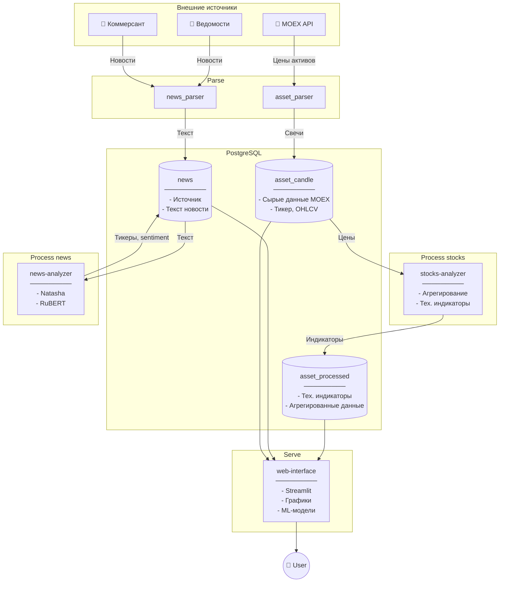

# Stocks Advisor

## О приложении

`Инвестиционный советник` - приложение, занимающееся прогнозированием цен на акции, основываясь на исторических данных и новостях.

### Архитектура



### Пайплайн работы приложения

#### 1. Парсинг

Собирает данные из нескольких источников и кладет в базу данных:

- "Японские свечи" с MOEX
- Новости из различных источников

#### 2. Обработка данных

Обрабатывает полученные данные:

- Рассчитывает технические индикаторы, скользящие средние и т.п.
- Анализирует влияние новости на рынок

#### 3. Прогнозирование

По запросу пользователя выдает прогнозируемую стоимость акций.

## Структура приложения

- **`alembic/`** - миграции в БД

- **`config/`** — настройки приложения

- **`core/`** — основная бизнес-логика приложения:
  - `clients/` — клиенты для внешних API
  - `database/` — работа с базой данных (БД)
    - `db_models` - SQLAlchemy модели таблиц БД. Из них alembic генерирует миграции в БД
    - `repository` - CRUD операции с таблицами БД
  - `processors/` - обработчики данных
  - `schemas/` - Pydantic схемы данных

- **`daemons/`** — демоны

- **`docs/`** — документация проекта

- **`web/`** — веб-приложение на FastAPI

## Разработка

### Как подключиться к БД?

#### С удаленной VM

Если код запускается в VM с доступом к БД, то в `.env` нужно указать IP адрес сервера с БД:

```env
DATABASE__HOST=<postgresql IP>
DATABASE__PORT=5432
DATABASE__NAME=stocks_advisor_db
DATABASE__USER=<user>
DATABASE__PASSWORD=<password>
```

#### Локально

Если код запускается локально на ноутбуке, то нужно сначала прокинуть порт БД через SSH:

```bash
ssh -L 5432:<postgresql IP>:5432 <user>@<server IP> -p <ssh port>
```

И указать в `.env` адрес `localhost`:

```env
DATABASE__HOST=localhost
DATABASE__PORT=5432
DATABASE__NAME=stocks_advisor_db
DATABASE__USER=<user>
DATABASE__PASSWORD=<password>
```

### Как добавить/изменить таблицу БД?

При добавлении новой модели SQLALchemy или при изменнии существующей модели, нужно:

- Запустить `uv run alembic -c app/alembic.ini revision --autogenerate -m <название_миграции>` (или `make alembic-generate-migration name=<название_миграции>`). Эта команда создаст миграцию в директории `app/alembic/versions`.
- Проверить созданную миграцию
- Запустить `uv run alembic upgrade head` (или `alembic-run-migration`). Эта команда выполнит миграцию в БД.
